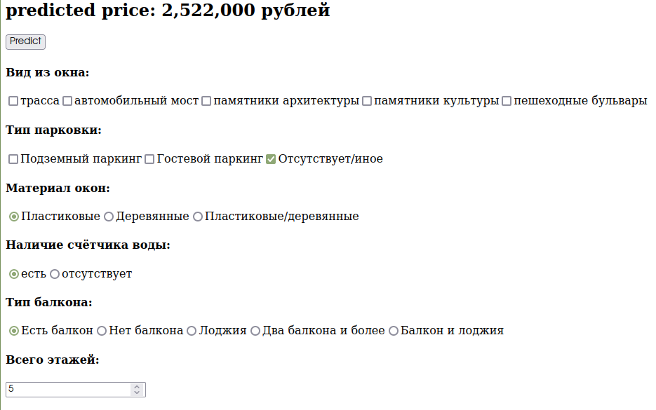

# ptz-flats-predict
This project predicts flat price in real-time, using machine learning techniques.
Current status:
* [ ] alpha
* [x] beta
* [ ] released
## How it works
`application.py` contains code that creates local server. On local server it is possible to change several parameters of flat (like square, adress, etc.). When all parameters used, button `predict` must be pressed. After that, the model will predict the flat price(in hundred thousand rubles) based on parameters input. The model prediction can be seen on site.
***

***
## How to use
This is simple python file, that can be used like any other python file.
However, in order to use this file, several things need to be done:
* Pandas, used to handle some data
* Numpy, used to handle some data
* Pickle, to load a model
* Dash, framework for web application
* Sklearn, used for handle some data
After installing all this libraries, you should be able to use
    `python application.py` in terminal.
